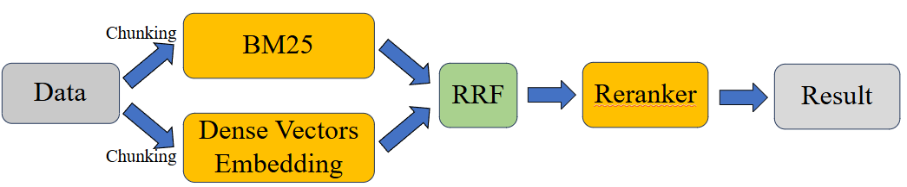
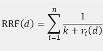

# AI CUP 2024 RAG 
### How to run the code?
1. Install dependencies:
   `pip install -r requirements.txt`

2. Set up the file path in the configuration section at the beginning of `main.ipynb`.

3. Run all the code in `main.ipynb`.

### Method

**Hybrid Retrieval (BM25 + Dense Vector Embedding)**  
For BM25, we adopted the baseline approach provided by the official guidelines. The chunking method is set so that one page of a PDF represents one chunk. For dense vector embedding, we used the **intfloat/multilingual-e5-large** model. This model was chosen because online evaluations indicate it performs best for traditional Chinese embedding tasks. Since the model supports up to 512 tokens as input, we set the chunk size to 512 tokens per chunk.  

**Reciprocal Rank Fusion (RRF)**  
After obtaining rankings from both BM25 and the vector-based method, we first fuse the rankings of chunks from the same document in the vector-based results. For each document, only the highest-ranked chunk is retained, and others are discarded. Then, we use **Reciprocal Rank Fusion (RRF)** to combine the rankings and derive a new final ranking. The RRF formula is as follows:  

Where:  
- \( d \): Document  
- \( n \): Number of retrieval models (we used two: BM25 and multilingual-e5-large)  
- \( r_i(d) \): Rank of document \( d \) in the \( i \)-th model  
- \( k \): Smoothing parameter, which performs best with a value of 60 according to research  

**Reranker**  
After obtaining the top-ranked search results through RRF, we pair the query with the top results for reranking. The reranker produces the final rankings. As the reranker has a maximum input size of 512 tokens, we use the vector-based chunks of size 512 tokens as input. Finally, the top result from the reranker output is selected as the retrieval result.  

### Data Preprocessing  
Our data preprocessing approach was straightforward, involving two different chunking methods:  
1. **BM25 method**: Each page of a PDF is treated as a single chunk.  
2. **Vector-based method**: Each chunk is composed of 512 tokens.  
